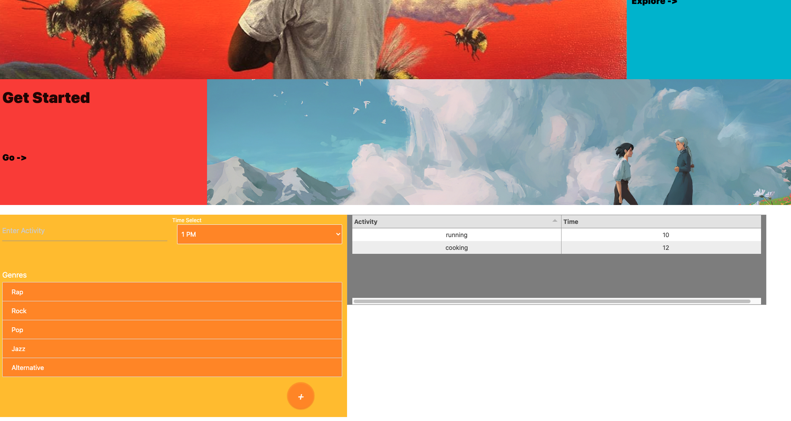
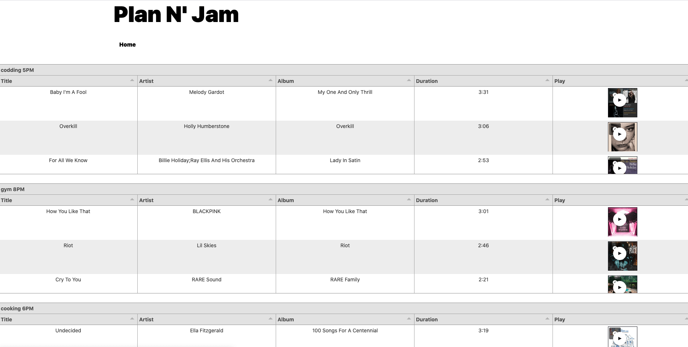

# Plan N' Jam

The objective of this project is to automatically generate a music playlist based on the selected genres by the user for each activity of the day. The user can enter the activity and select the timeslot then the playlist will be randomly generated based on the selected musical genres and saved to the page. All generated playlists will be available to the user in View Activity page, where user can view the upcoming activities and listen to generated playlists via Deezer Player Widget.

## Link to the Deployed application 
-   [Plan N' Jam](https://liza-p.github.io/project-1/)

## Project management board 
- [Github Project](https://github.com/liza-p/project-1/projects/1)
## End to End flow 

- Given a user want to generate a playlist 
When a user enters the Activity Name, Select the time slot from the dropdown
- And chooses one or more genres from the list 
- Then playlist will be generated with songs randomly selected from each chosen genre 

- When a user chooses more than one genre from the list
- Then songs will be randomly selected from each genre

- When a user clicked “+” add an activity button 
- Then activity name, time slot, song: title, artist, album and duration stored to the local storage

- When a user clicked “+” add an activity button 
- Then Activity name and a time slot will be appended to the Home page

- Given a user want to see their generated playlists for each activity
- When user click on View Activity
- Then user can see tables generated for each activity with the activity Title and time slot selected and song: title, artist, album and duration data from local storage

- Given a user want to listen to the generated playlist
- When user navigates to the View Activity Page
- Then user can listen to the generated playlist

## Technologies Used 

- JQuery - used for DOM manupulation and ajax request
- Materialize - CSS Framework
- HTML - used to create elements on the DOM
- CSS - styles html elements on page
- GitHub - hosts repository that can be deployed to GitHub Pages
- Deezer API allows you to listen to more than 30 million tracks, create your own playlists, and share your favourite tracks.
- Deezer Player Widget 

- 

## Contributors
- [Daniel Jauregui](https://github.com/Kionling)
- [Liza Poliachenko](https://github.com/liza-p)
- [Royce Williams](https://github.com/RoyceWilliams510)

